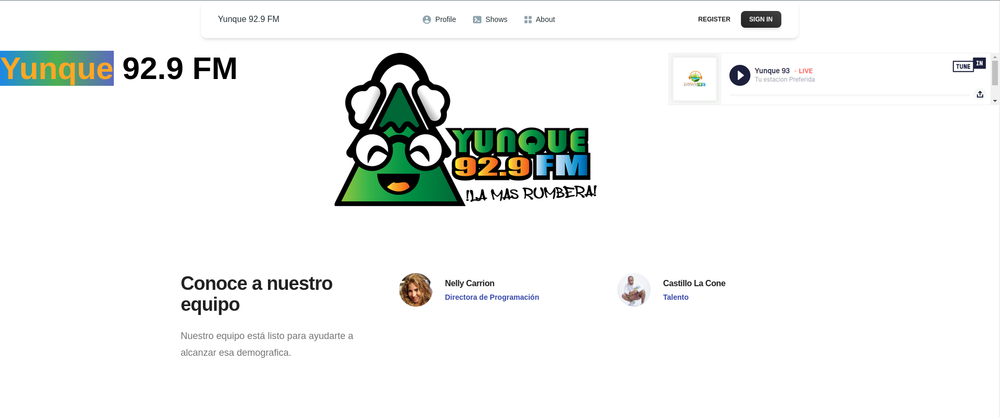

# Student Commerce Online


- [Technologies Used](#technologies)
- [Installation](#installation)
- [Screenshots](#screenshots)


## Technologies Used

- HTML
- CSS
- Javascript
- React
- Vite
- Node.js

## Installation

1. Clone repository:

   ```bash
   git clone https://github.com/celicasti9/react-project-2.git

## Screenshots
   
